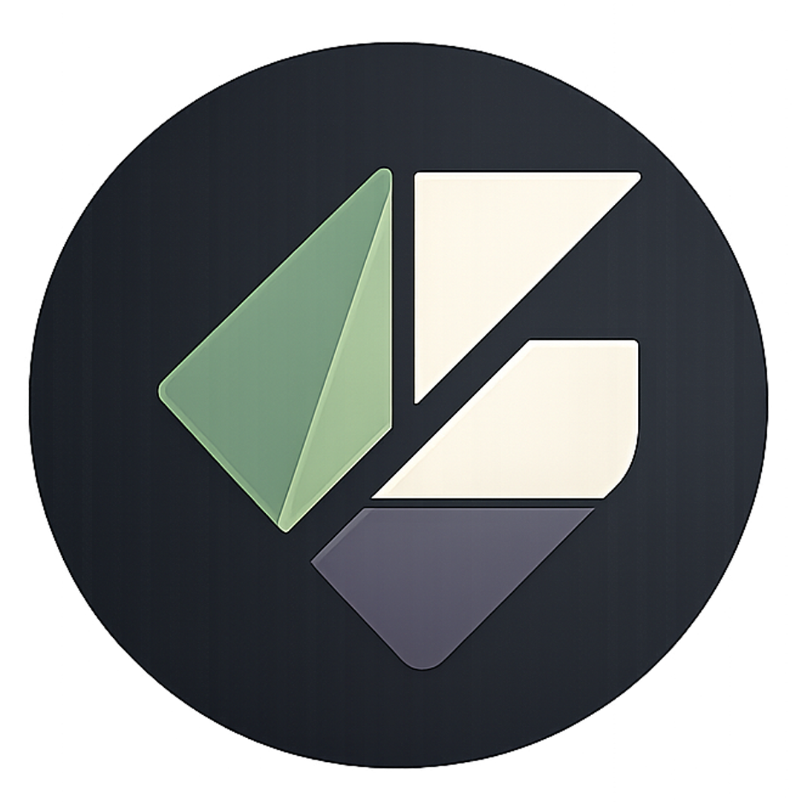

<p align="center">
  
</p>

<h1 align="center">Glyph</h1>

<p align="center">
  A GPU-accelerated UI framework for Rust.
</p>

<p align="center">
  <a href="#quick-start">Quick Start</a> · <a href="#example">Example</a> · <a href="#crates">Crates</a> · <a href="#status">Status</a>
</p>

---

Glyph is a desktop UI framework built on [wgpu](https://github.com/gfx-rs/wgpu) and [Taffy](https://github.com/DioxusLabs/taffy). You describe your interface as a `View` tree, bind state with `Signal<T>`, and the platform loop redraws automatically on every write.

```rust
App::run(
    |theme, _opener| {
        let view = column(vec![
            text("Hello, Glyph!", 32.0).color(theme.text).into(),
        ])
        .padding(32.0)
        .into();
        (theme.clone(), view)
    },
    Theme::light(),
    "My App",
    800.0,
    600.0,
);
```

## Quick Start

```sh
git clone https://github.com/camslade/glyph
cd glyph
cargo run -p demo-glyph
```

## Example

A reactive counter with a button:

```rust
use core_glyph::{Signal, Theme, button, column, row, text};
use platform_glyph::App;

fn main() {
    let count = Signal::new(0i32);

    App::run(
        move |theme, _opener| {
            let c = count.clone();
            let view = row(vec![
                text(format!("Count: {}", count.get()), 24.0)
                    .color(theme.text)
                    .into(),
                button("Increment", move || c.set(c.get() + 1))
                    .bg(theme.primary)
                    .text_color(theme.on_primary)
                    .radius(theme.radius)
                    .into(),
            ])
            .gap(16.0)
            .padding(32.0)
            .into();
            (theme.clone(), view)
        },
        Theme::light(),
        "Counter",
        480.0,
        120.0,
    );
}
```

## Multi-window

Open new windows from any button callback via the `WindowOpener` handle:

```rust
App::run(
    move |theme, opener| {
        let o = opener.clone();
        let view = button("Open second window", move || {
            o.open(
                |t, _| (t.clone(), text("Hello from window 2!", 24.0).into()),
                "Window 2",
                400.0,
                200.0,
                Theme::dark(),
            );
        })
        .bg(theme.primary)
        .text_color(theme.on_primary)
        .radius(theme.radius)
        .into();
        (theme.clone(), view)
    },
    Theme::light(),
    "Main",
    600.0,
    200.0,
);
```

## Signals

`Signal<T>` is a cloneable reactive cell. Any write sets a dirty flag; the platform loop redraws automatically.

```rust
let value = Signal::new(0i32);
let v = value.clone();

// In a button callback:
v.set(v.get() + 1); // triggers a redraw
```

## Animations

`Tween<T>` smoothly interpolates a `Signal<T>` between values:

```rust
let bg = Signal::new(theme.primary);
let tween = Tween::new(bg.clone(), Easing::EaseOut, 0.15);

// On hover:
tween.start(hover_color);
```

## How it works

Each frame runs two GPU passes:

1. **Rect pass** — filled rectangles and button backgrounds rendered with a WGSL SDF shader; anti-aliased rounded corners at any radius
2. **Text pass** — glyphs shaped by [cosmic-text](https://github.com/pop-os/cosmic-text), packed into an atlas, composited on top of rects

Layout is computed by [Taffy](https://github.com/DioxusLabs/taffy) (flexbox) each frame using real shaped text metrics for intrinsic sizing.

## Crates

| Crate | Role |
|---|---|
| `core-glyph` | `View` tree, `Signal<T>`, Taffy layout, flat quad output |
| `text-glyph` | cosmic-text shaping, glyph atlas, text measurement |
| `render-glyph` | wgpu pipelines, rect / text / image renderer |
| `platform-glyph` | winit event loop, hit-test, click / hover / scroll / keyboard |
| `native-glyph` | macOS AppKit bridge (objc2) |
| `widgets-glyph` | pre-built widgets: `Checkbox`, `Toggle`, `Slider`, `RadioGroup`, `Select` |
| `ui-glyph` | design system: Tailwind-style color palette, spacing tokens, typography helpers, layout primitives, and a full component library (`card`, `badge`, `avatar`, `alert`, `tab_bar`, …) |
| `hot-glyph` | hot-reload dylib loader |
| `demo-glyph` | interactive demo app |
| `github-glyph` | GitHub dashboard example app |

## Status

| Feature | Status |
|---|---|
| GPU rect + text + image rendering | ✅ |
| Signal-driven redraws | ✅ |
| Flexbox layout (Taffy) | ✅ |
| Text input with cursor, selection, IME | ✅ |
| Mouse hit-test, click, hover, scroll | ✅ |
| Container backgrounds, borders, shadows | ✅ |
| Rounded corners (SDF, any radius) | ✅ |
| Clip regions | ✅ |
| ZStack / flex grow / spacer | ✅ |
| Scroll views (trackpad + mouse wheel momentum) | ✅ |
| Virtual list (O(visible) rendering) | ✅ |
| Tween animations | ✅ |
| Multi-window | ✅ |
| Hot-reload | ✅ |
| Widget library (Checkbox, Toggle, Slider, …) | ✅ |
| macOS AppKit native bridge | ✅ |
| Custom fonts | ❌ |
| Accessibility | ❌ |
| Linux / Windows | wgpu handles backends; untested |

## License

MIT — see [LICENSE](LICENSE).
