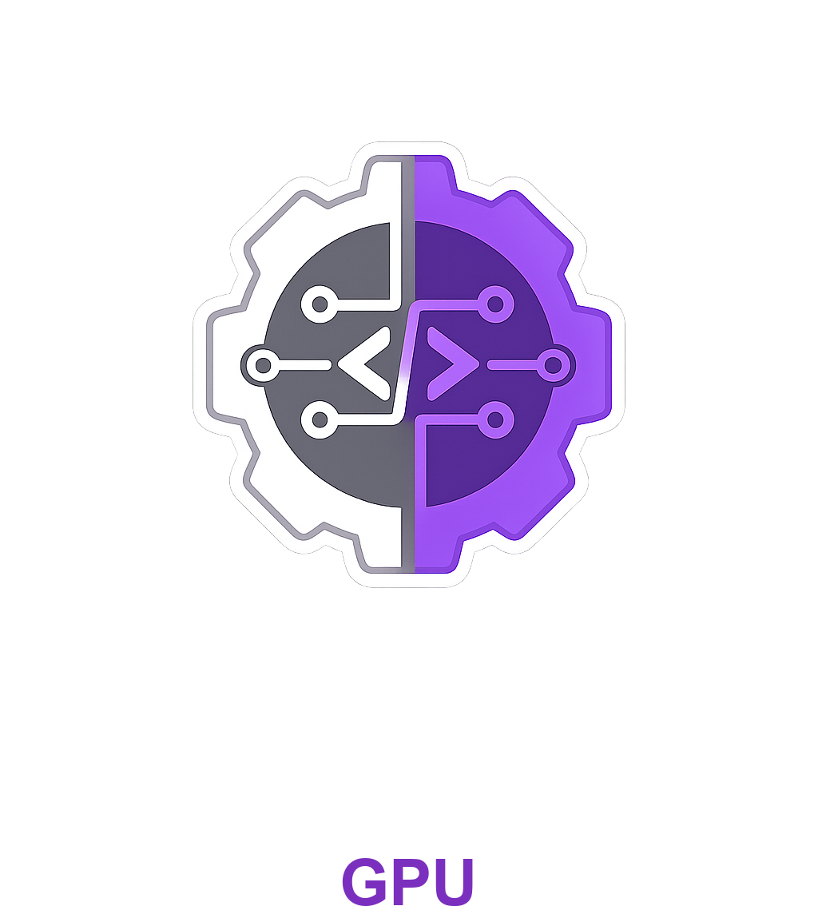

# Binate GPU

A GPU-accelerated reactive UI framework for Rust. Custom wgpu rendering pipeline, signal-based state, flexbox layout, and a macOS native bridge — all in one workspace.

## Architecture

```
binate-gpu-core      Signal<T>, View tree (Column/Row/Text/Button/Rect), builder API, Taffy layout
binate-gpu-text      cosmic-text integration, glyph atlas, text measurement and shaping
binate-gpu-render    wgpu render pipelines — SDF rounded rects and glyph atlas text
binate-gpu-platform  winit event loop, signal-driven redraws, mouse hit-test, click handlers
binate-gpu-native    AppKit bridge — renders View trees as native NSStackView/NSTextField/NSButton
binate-gpu-demo      Counter app — the canonical working example
```

## Quick Start

```bash
cargo run -p binate-gpu-demo
```

The demo opens an 800×600 window with a reactive counter backed by `Signal<i32>`.

## Example

```rust
use binate_gpu_core::{Color, FontWeight, Signal, button, column, text};
use binate_gpu_platform::App;

fn main() {
    let count = Signal::new(0i32);
    App::run(move || {
        column(vec![
            text(format!("Count: {}", count.get()), 48.0)
                .weight(FontWeight::Bold)
                .into(),
            text("Click the button to increment.", 16.0)
                .color(Color::rgb(0.5, 0.5, 0.5))
                .into(),
            button("Click me", {
                let count = count.clone();
                move || count.set(count.get() + 1)
            })
            .bg(Color::rgb(0.1, 0.1, 0.9))
            .text_color(Color::WHITE)
            .radius(10.0)
            .font_size(16.0)
            .into(),
        ])
    });
}
```

## Rendering

The GPU path runs two passes per frame:

1. **Rect pass** — each `Rect` and `Button` background is drawn with a WGSL SDF shader that produces anti-aliased rounded corners at any radius.
2. **Text pass** — glyphs are shaped by cosmic-text, packed into a 1024×1024 atlas, and rendered via a second pipeline that samples the atlas alpha and applies vertex color.

Both pipelines use alpha blending; rects are submitted first so text always composites on top.

## Layout

`binate-gpu-core` converts the `View` tree into a flat list of positioned quads using [Taffy](https://github.com/DioxusLabs/taffy) (flexbox). Each `Column` and `Row` maps to a flex container; `Text`, `Button`, and `Rect` are leaf nodes with intrinsic sizes measured before layout runs.

## Signals

```rust
let value = Signal::new(42i32);
value.set(value.get() + 1); // marks the window dirty
// next frame: App detects needs_redraw(), calls your closure, re-renders
```

`Signal<T>` wraps an `Arc<Mutex<T>>` and sets a thread-local dirty flag on write. The platform loop checks this flag after every event and requests a redraw when it's set.

## Native Bridge (macOS)

`binate-gpu-native` converts the same `View` tree into a live `NSStackView` hierarchy using objc2 bindings. Button callbacks are stored as fat-pointer closures behind an Objective-C `ActionTarget` class. This path is compile-tested but not yet wired to a demo binary — the GPU path (`binate-gpu-platform`) is the primary runtime today.

## Status

| Feature | Status |
|---|---|
| GPU rect + text rendering | Working |
| Signal-driven redraws | Working |
| Flexbox layout (Taffy) | Working |
| Mouse hit-test + click | Working |
| macOS native bridge | Compiles, no demo yet |
| Scrolling | Not implemented |
| Text input | Not implemented |
| Linux / Windows | wgpu handles backends; platform layer untested |
| Component model | Not implemented |
| Hot-reload | Not implemented |

## License

MIT — see [LICENSE](LICENSE).
